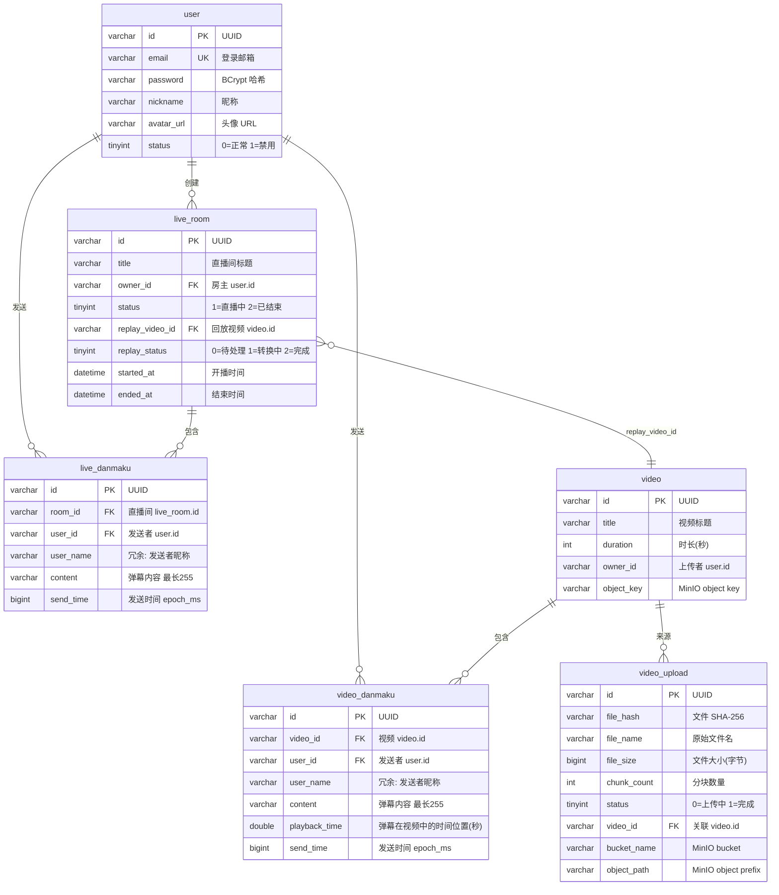

# DanmakuLive 数据库文档

## 概览

- **数据库**: MySQL 8.0, InnoDB, utf8mb4
- **ID 策略**: 全表统一使用 UUID v4 字符串（MyBatis-Plus `IdType.ASSIGN_UUID`）
- **时间戳**: 所有表继承 `create_time` / `update_time`，由 `BaseDO` + MyBatis-Plus 自动填充
- **软删除**: 未启用（项目初期，弹幕数据有归档价值）

## ER 图



## 表设计

### 1. user — 用户账户

| 字段 | 类型 | 说明 |
|------|------|------|
| id | VARCHAR(36) PK | UUID |
| email | VARCHAR(255) UNIQUE | 登录邮箱 |
| password | VARCHAR(255) | BCrypt 加密（Spring Security Crypto） |
| nickname | VARCHAR(64) | 显示昵称 |
| avatar_url | VARCHAR(512) | 头像链接，默认空串 |
| status | TINYINT | 0=正常, 1=禁用 |

**索引**: `uk_email` — 登录时按邮箱查用户，唯一约束防止重复注册。

---

### 2. live_room — 直播间

| 字段 | 类型 | 说明 |
|------|------|------|
| id | VARCHAR(36) PK | UUID |
| title | VARCHAR(128) | 直播间标题 |
| owner_id | VARCHAR(36) | 房主 user.id |
| status | TINYINT | 1=直播中, 2=已结束 |
| replay_video_id | VARCHAR(36) | 回放视频 video.id（直播结束后关联） |
| replay_status | TINYINT | 0=待处理, 1=转换中, 2=完成 |
| started_at | DATETIME | 开播时间 |
| ended_at | DATETIME | 结束时间，直播中为 NULL |

**索引**:
- `idx_owner` — 查询某用户的所有直播间
- `idx_status` — 查询正在直播的房间列表

**生命周期**:
```
开播(status=1) → 结束(status=2, replay_status=0) → 回放转换(1→2)
```

---

### 3. live_danmaku — 直播弹幕

核心表，P0 功能。支撑高并发写入和按直播间分段拉取。

| 字段 | 类型 | 说明 |
|------|------|------|
| id | VARCHAR(36) PK | UUID |
| room_id | VARCHAR(36) | 直播间 live_room.id |
| user_id | VARCHAR(36) | 发送者 user.id |
| user_name | VARCHAR(64) | 冗余字段，避免 JOIN user 查昵称 |
| content | VARCHAR(255) | 弹幕内容 |
| send_time | BIGINT | 发送时间 epoch_ms |

**索引**:
- `idx_room_time (room_id, send_time DESC)` — **核心查询索引**：按直播间 + 时间倒序拉取弹幕列表，覆盖 90% 查询
- `idx_user (user_id)` — 查询用户发送历史

**设计决策**: `user_name` 冗余存储。在高并发弹幕场景下，发送弹幕时直接写入昵称，避免每次查询都 JOIN user 表。昵称变更不影响历史弹幕展示（显示发送时的昵称）。

---

### 4. video — 视频

P1 功能，预置种子数据用于演示视频弹幕。上传合并完成后关联 MinIO 对象。

| 字段 | 类型 | 说明 |
|------|------|------|
| id | VARCHAR(36) PK | UUID |
| title | VARCHAR(128) | 视频标题 |
| duration | INT | 时长（秒） |
| owner_id | VARCHAR(36) | 上传者 user.id，mock 数据为 NULL |
| object_key | VARCHAR(512) | MinIO object key，播放时生成预签名 URL |

当前无独立索引。查询场景单一（按 ID 查），主键索引即可覆盖。

---

### 5. video_danmaku — 视频弹幕

与直播弹幕结构类似，但用 `playback_time` 替代 `send_time`：弹幕绑定视频播放位置而非实时时间。

| 字段 | 类型 | 说明 |
|------|------|------|
| id | VARCHAR(36) PK | UUID |
| video_id | VARCHAR(36) | 视频 video.id |
| user_id | VARCHAR(36) | 发送者 user.id |
| user_name | VARCHAR(64) | 冗余字段 |
| content | VARCHAR(255) | 弹幕内容 |
| playback_time | DOUBLE | 弹幕在视频中的时间位置（秒），支持小数 |
| send_time | BIGINT | 发送时间 epoch_ms，与 live_danmaku 对齐 |

**索引**:
- `idx_video_time (video_id, playback_time)` — 按视频 + 播放位置查询弹幕，支持前端按播放进度分段拉取

**查询模式**: 前端根据当前播放进度请求 `[playback_time - N, playback_time + N]` 范围内的弹幕，索引直接覆盖范围扫描。

---

### 6. video_upload — 视频上传任务

P1 功能，追踪 MinIO 分块上传状态，支持 SHA-256 秒传。

| 字段 | 类型 | 说明 |
|------|------|------|
| id | VARCHAR(36) PK | UUID |
| file_hash | VARCHAR(64) | 文件 SHA-256 哈希 |
| file_name | VARCHAR(255) | 原始文件名 |
| file_size | BIGINT | 文件大小（字节） |
| chunk_count | INT | 分块总数 |
| status | TINYINT | 0=上传中, 1=完成 |
| video_id | VARCHAR(36) | 合并后关联的 video 记录 |
| bucket_name | VARCHAR(64) | MinIO bucket 名称 |
| object_path | VARCHAR(512) | MinIO 对象路径前缀 |

**秒传逻辑**: 上传前先查询 `file_hash` 是否已存在 `status=1` 的记录，存在则跳过上传直接关联。

**索引**:
- `uk_file_hash (file_hash)` UNIQUE — 秒传检测 + 并发防重

## 索引策略总结

| 表 | 索引 | 类型 | 覆盖查询 |
|----|------|------|----------|
| user | uk_email | UNIQUE | 登录、注册去重 |
| live_room | idx_owner | 普通 | 我的直播间列表 |
| live_room | idx_status | 普通 | 正在直播列表 |
| live_danmaku | idx_room_time | 联合 (room_id, send_time DESC) | 直播间弹幕分页拉取 |
| live_danmaku | idx_user | 普通 | 用户弹幕历史 |
| video_danmaku | idx_video_time | 联合 (video_id, playback_time) | 按播放进度分段拉取弹幕 |
| video_upload | uk_file_hash | UNIQUE | 秒传检测、并发防重 |

## 数据流

```
用户注册 → user 表
    │
    ├─ 创建直播间 → live_room 表
    │     └─ 发送直播弹幕 → live_danmaku 表 (→ Kafka → Redis Pub/Sub 广播)
    │        (直播结束后) → 生成回放 → video 表 + live_room.replay_video_id
    │
    └─ 上传视频 → video_upload 表 (MinIO 分块)
          └─ 上传完成 → video 表 (含 object_key)
                ├─ 发送视频弹幕 → video_danmaku 表 (Redis ZSET 缓存)
                └─ GET /api/v1/video/{id}/play → MinIO GET 预签名 URL → 前端播放
```

## 测试数据

通过 `scripts/import_data.py` 从公开数据集导入：

| 表 | 数据量 | 来源 |
|----|--------|------|
| user | 300 | channels.csv 频道房主 |
| live_room | 300 | VTuber 1B Elements — 1359 频道取前 300 |
| live_danmaku | 512,501 | sensai — YouTube VTuber 直播聊天，真实日/英弹幕 |
| video | 102 | 100 生成 + 2 mock |
| video_danmaku | 50,000 | 从 live_danmaku 采样生成 |

数据来源详见 `.claude/notes/decisions.md` §11。

使用方式：
```bash
# 完整导入（需 Docker MySQL 运行）
python3 scripts/import_data.py --generate-video --limit 500000

# 仅直播数据（需 Kaggle API key）
python3 scripts/import_data.py --skip-video
```

## 缓存策略（Redis）

| 数据 | Redis 结构 | 说明 |
|------|-----------|------|
| 直播弹幕 | Pub/Sub Channel | 实时跨节点广播 |
| 视频弹幕 | ZSET `video:danmaku:{videoId}` | score=playback_time，支持按播放位置范围查询 |
| 用户 Token | Hash `user:{userId}` | 登录态存储 |
| 限流计数 | ZSET 滑动窗口 | 弹幕发送频率控制 |
